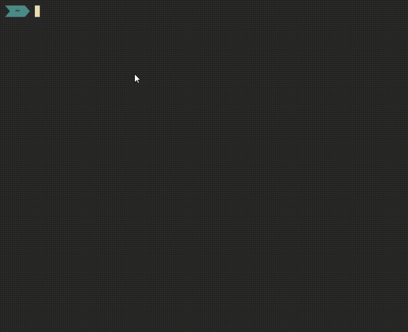

# music_player
Ein einfacher lokaler Musikdateienabspieler, mit rodio und ratatui



Per Default sucht es in $HOME/.config/music_player/path nach einem File, in dem der Path zum Öffnen steht, ein solches File könnte dann so aussehen :

```
C:\Users\phili\Music

```
Ansonsten kann man auch per argument den Path vorgeben:
```
music_player .
```

## Keybinds:
```
l     = geht in das ausgewählte dir
h     = geht ein dir zurück
o     = addiert den ausgewählten Song zur Warteschlange
k     = geht im aktuellen dir nach oben
j     = geht im aktuellen dir nach unten
a     = spult 10s zurück
k     = spult 10s nach vorne
0..9  = springt zu z.B. Dauer * 0.3 
w     = Volume hoch
s     = Volume runter
n     = geht zum nächsten Song in der Warteschlange
c     = cleare alle Songs in der Warteschlange
q     = quit
r     = toggle Repeat für den aktuellen Song
p     = toggles random play Mode for the dir under the Cursor
space = toggle Pausiert
```
